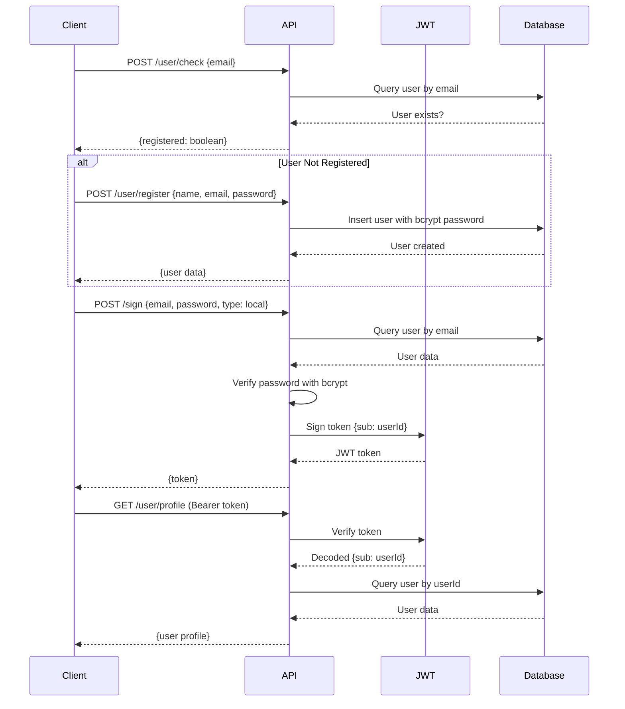
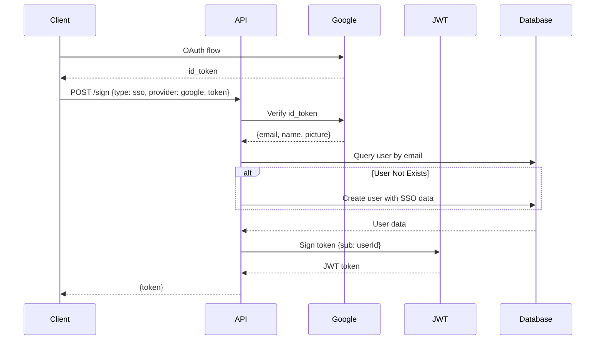
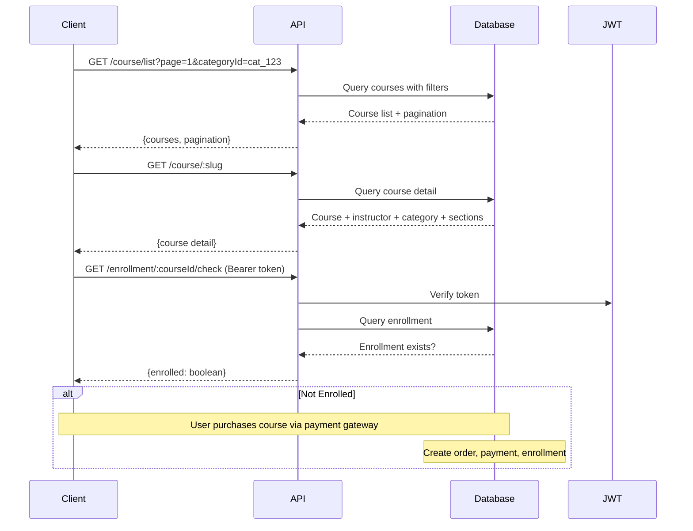
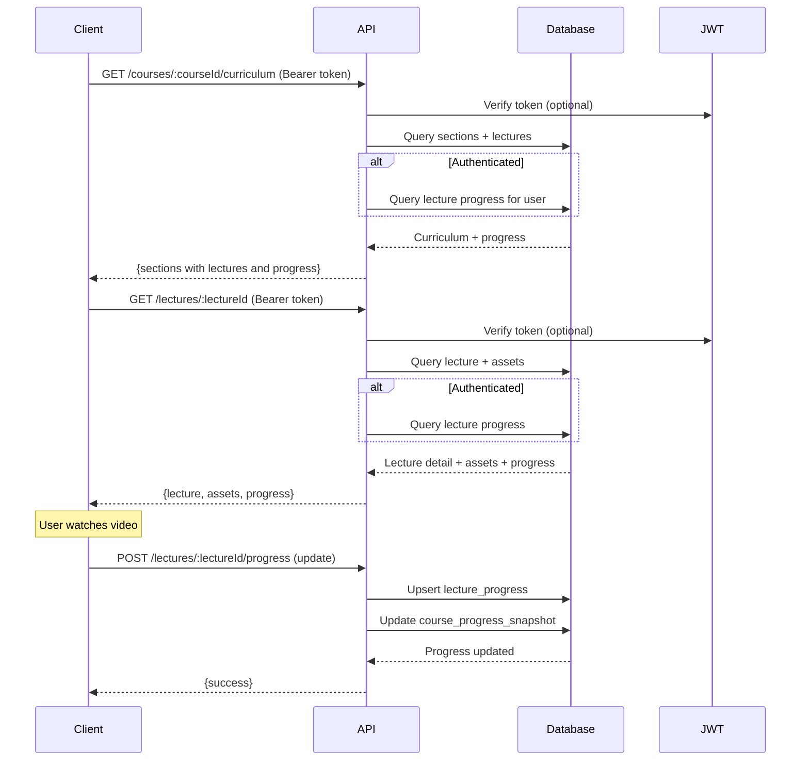

# Dokumentasi Backend - Amanah Education Centre

## Daftar Isi

1. [Gambaran Umum](#gambaran-umum)
2. [Arsitektur Sistem](#arsitektur-sistem)
3. [Teknologi yang Digunakan](#teknologi-yang-digunakan)
4. [Struktur Database](#struktur-database)
5. [API Endpoints](#api-endpoints)
6. [Alur Kerja Aplikasi](#alur-kerja-aplikasi)
7. [Autentikasi & Autorisasi](#autentikasi--autorisasi)
8. [Error Handling](#error-handling)
9. [Setup dan Konfigurasi](#setup-dan-konfigurasi)
10. [Deployment](#deployment)

---

## Gambaran Umum

Backend ini adalah RESTful API untuk platform Learning Management System (LMS) yang dibangun dengan **Elysia.js** dan **Bun runtime**. Platform ini menyediakan fitur untuk mengelola kursus online, enrollment siswa, tracking progress, sistem pembayaran, quiz, sertifikat, dan fitur marketplace pendidikan lainnya.

### Fitur Utama

- **User Management**: Registrasi, login (local + SSO Google), profil user
- **Course Management**: CRUD kursus, kategori, level, tags, instructor
- **Curriculum Management**: Sections, lectures, assets (video, PDF, dokumen)
- **Enrollment & Progress**: Tracking progress per lecture dan course
- **Reviews & Ratings**: Sistem review dan rating untuk kursus
- **Q&A System**: Diskusi per lecture atau course
- **Quiz & Assessment**: Quiz dengan multiple choice, passing score
- **Certificates**: Generate sertifikat setelah menyelesaikan kursus
- **E-Commerce**: Orders, payments, coupons, refunds, wishlist, cart, bundles

---

## Arsitektur Sistem

### Tech Stack

| Layer                 | Technology                          |
| --------------------- | ----------------------------------- |
| **Runtime**           | Bun (JavaScript runtime)            |
| **Framework**         | Elysia.js (Web framework)           |
| **Database**          | Turso (LibSQL/SQLite)               |
| **ORM**               | Drizzle ORM                         |
| **Authentication**    | JWT (@elysiajs/jwt)                 |
| **API Documentation** | OpenAPI/Swagger (@elysiajs/openapi) |
| **Logging**           | @bogeychan/elysia-logger            |
| **Deployment**        | Vercel                              |

### Arsitektur Folder

```
be/
├── src/
│   ├── index.ts                   # Entry point & route definitions
│   ├── plugin/
│   │   └── database/
│   │       ├── client.ts          # Database connection
│   │       ├── schema.ts          # Database schema (Drizzle)
│   │       ├── relations.ts       # Table relations
│   │       └── populate.ts        # Seed data
│   ├── queries/                   # Database query functions
│   │   ├── category.ts
│   │   ├── course.ts
│   │   ├── enrollment.ts
│   │   ├── instructor.ts
│   │   ├── lecture.ts
│   │   ├── profile.ts
│   │   ├── review.ts
│   │   ├── tags.ts
│   │   └── user.ts
│   ├── schemas/                   # Type definitions & validation
│   │   ├── api.schema.ts
│   │   ├── category.schema.ts
│   │   ├── course.schema.ts
│   │   ├── enrollment.schema.ts
│   │   ├── instructor.schema.ts
│   │   ├── lecture.schema.ts
│   │   ├── profile.schema.ts
│   │   ├── sign.schema.ts
│   │   ├── tag.schema.ts
│   │   └── user.schema.ts
│   └── utils/
│       ├── google.ts              # Google OAuth verification
│       └── response.ts            # Response helpers (ok/fail)
├── drizzle/                       # Database migrations
├── drizzle.config.ts              # Drizzle configuration
├── package.json
├── tsconfig.json
└── vercel.json                    # Vercel deployment config
```

---

## Teknologi yang Digunakan

### 1. Bun Runtime

- **High-performance JavaScript runtime** sebagai alternatif Node.js
- Built-in package manager, test runner, dan bundler
- Kompatibel dengan Node.js APIs
- Mendukung TypeScript secara native

### 2. Elysia.js

- **Modern web framework** yang dioptimasi untuk Bun
- Type-safe dengan TypeScript
- Built-in validation menggunakan TypeBox
- Middleware-based architecture
- OpenAPI/Swagger generation otomatis

### 3. Turso Database

- **Edge database** berbasis LibSQL (fork dari SQLite)
- Distributed SQLite untuk low latency
- HTTPS API untuk koneksi
- Mendukung multi-region replication

### 4. Drizzle ORM

- **TypeScript ORM** yang type-safe
- SQL-like query builder
- Automatic migrations
- Zero runtime overhead

---

## Struktur Database

### Entity Relationship Diagram (Konseptual)

```
┌─────────────┐       ┌─────────────┐
│    Users    │───────│    Roles    │
└─────────────┘       └─────────────┘
       │
       ├─────────────┐
       │             │
┌──────▼──────┐ ┌───▼──────────┐
│  Courses    │ │ Enrollments  │
│ (instructor)│ │              │
└──────┬──────┘ └───┬──────────┘
       │            │
       ├────────────┤
       │            │
┌──────▼──────┐ ┌──▼───────────┐
│  Sections   │ │   Progress   │
└──────┬──────┘ └──────────────┘
       │
┌──────▼──────┐
│  Lectures   │
└──────┬──────┘
       │
┌──────▼──────┐
│   Assets    │
└─────────────┘
```

### Tabel Utama

#### 1. Users & Roles

- **users**: Data user (id, name, email, password, avatar, bio, dll)
- **roles**: Role definition (student/instructor/admin)
- **user_roles**: Many-to-many relation user-role

#### 2. Courses & Categories

- **courses**: Data kursus (title, slug, description, price, rating, dll)
- **categories**: Kategori kursus (hierarki dengan parent_id)
- **course_levels**: Level kesulitan (beginner/intermediate/advanced)
- **course_tags**: Tags untuk filtering
- **course_requirements**: Prerequisites
- **course_outcomes**: Learning outcomes
- **course_target_audience**: Target audience description

#### 3. Curriculum

- **course_sections**: Sections/chapters dalam kursus
- **course_lectures**: Lectures/lessons dalam section
- **lecture_assets**: Video, PDF, files untuk lecture

#### 4. Enrollment & Progress

- **enrollments**: User enrollment ke course
- **lecture_progress**: Progress per lecture (not_started/in_progress/completed)
- **course_progress_snapshot**: Snapshot progress keseluruhan course

#### 5. E-Commerce

- **orders**: Order transaksi
- **order_items**: Items dalam order (course/bundle)
- **coupons**: Discount coupons
- **coupon_courses**: Coupon applicability per course
- **refunds**: Refund requests

#### 6. Reviews & Q&A

- **course_reviews**: Review dan rating
- **course_questions**: Pertanyaan di course/lecture
- **course_answers**: Jawaban untuk pertanyaan
- **question_votes**: Voting untuk pertanyaan

#### 7. Quiz & Assessments

- **quizzes**: Quiz definition
- **quiz_questions**: Pertanyaan quiz
- **quiz_options**: Pilihan jawaban
- **quiz_attempts**: User quiz attempts
- **quiz_attempt_answers**: Jawaban user per attempt

#### 8. Certificates

- **certificates**: Sertifikat completion

#### 9. Marketplace

- **wishlists**: User wishlist
- **carts**: Shopping cart
- **cart_items**: Items dalam cart
- **bundles**: Course bundles
- **bundle_courses**: Courses dalam bundle

### Konvensi Database

#### Tipe Data

- **ID**: `text` (UUID atau nanoid)
- **Timestamp**: `integer` (UNIX seconds)
- **Boolean**: `integer` (0 atau 1)
- **Currency**: `integer` (smallest unit, e.g., Rupiah)
- **JSON**: `text` (JSON string)

#### Naming Convention

- Table: `snake_case` plural (e.g., `course_lectures`)
- Column: `snake_case` (e.g., `created_at`)
- Foreign Key: `{table}_id` (e.g., `user_id`)
- Index: `{table}_{column}_idx`
- Unique Index: `{table}_{column}_uidx`

#### Relational Integrity

- **ON DELETE CASCADE**: Untuk data dependencies (e.g., lectures → course)
- **ON DELETE RESTRICT**: Untuk prevent accidental deletion (e.g., instructor → course)
- **ON DELETE SET NULL**: Untuk optional relations (e.g., category → course)

---

## API Endpoints

### Response Format

Semua response mengikuti format standar:

```typescript
// Success Response
{
  ok: true,
  status: 200,
  message: "OK",
  data: <any>
}

// Error Response
{
  ok: false,
  status: <error_code>,
  message: "An error occured",
  errors: [
    {
      code: <number>,
      message: <string>
    }
  ]
}
```

### Authentication

Endpoints yang memerlukan authentication menggunakan **Bearer Token** di header:

```http
Authorization: Bearer <jwt_token>
```

### Endpoints Overview

#### 1. Authentication & User Management

##### POST `/sign`

Sign in user (local atau SSO)

**Request Body:**

```json
{
  "type": "local" | "sso",
  "email": "user@example.com",
  "password": "password123",  // untuk local
  "provider": "google",        // untuk SSO
  "token": "<google_id_token>" // untuk SSO
}
```

**Response:**

```json
{
  "ok": true,
  "status": 200,
  "message": "OK",
  "data": {
    "token": "<jwt_token>"
  }
}
```

##### POST `/user/check`

Check apakah user sudah terdaftar

**Request Body:**

```json
{
  "email": "user@example.com"
}
```

**Response:**

```json
{
  "ok": true,
  "status": 200,
  "message": "OK",
  "data": {
    "registered": true
  }
}
```

##### POST `/user/register`

Register user baru

**Request Body:**

```json
{
  "name": "John Doe",
  "email": "user@example.com",
  "password": "password123",
  "username": "johndoe" // optional
}
```

##### GET `/user/profile` 🔒

Get current user profile (Protected)

**Headers:**

```
Authorization: Bearer <jwt_token>
```

**Response:**

```json
{
  "ok": true,
  "status": 200,
  "message": "OK",
  "data": {
    "id": "user_123",
    "name": "John Doe",
    "email": "user@example.com",
    "avatar": "https://...",
    "bio": "..."
    // ... user fields
  }
}
```

#### 2. Courses

##### GET `/course/list`

Get list of courses dengan pagination dan filtering

**Query Parameters:**

- `page`: Page number (default: 1)
- `pageSize`: Items per page (default: 12, max: 50)
- `q`: Search query (title, subtitle)
- `categoryId`: Filter by category ID
- `status`: Filter by status (default: "published")

**Response:**

```json
{
  "ok": true,
  "status": 200,
  "message": "OK",
  "data": {
    "courses": [
      {
        "id": "course_123",
        "title": "JavaScript Fundamentals",
        "slug": "javascript-fundamentals",
        "subtitle": "Learn JS from scratch",
        "thumbnailUrl": "https://...",
        "currency": "IDR",
        "priceCurrent": 199000,
        "ratingAvg": 4.5,
        "ratingCount": 150,
        "studentCount": 1000,
        "instructor": {
          "id": "user_456",
          "name": "Jane Smith",
          "avatar": "https://..."
        },
        "category": {
          "id": "cat_789",
          "name": "Programming",
          "slug": "programming"
        }
      }
      // ... more courses
    ],
    "pagination": {
      "page": 1,
      "pageSize": 12,
      "totalPages": 5,
      "totalItems": 60
    }
  }
}
```

##### GET `/course/:courseIdentifier`

Get course detail by ID atau slug

**Response:**

```json
{
  "ok": true,
  "status": 200,
  "message": "OK",
  "data": {
    "id": "course_123",
    "title": "JavaScript Fundamentals",
    "slug": "javascript-fundamentals",
    "description": "<rich text HTML>",
    "thumbnailUrl": "https://...",
    "promoVideoUrl": "https://...",
    "currency": "IDR",
    "priceBase": 299000,
    "priceCurrent": 199000,
    "ratingAvg": 4.5,
    "ratingCount": 150,
    "studentCount": 1000,
    "instructor": {
      /* instructor data */
    },
    "category": {
      /* category data */
    },
    "level": {
      /* level data */
    },
    "requirements": ["Basic computer skills"],
    "outcomes": ["Understand JS basics", "Build web apps"],
    "targetAudience": ["Beginners", "Career switchers"],
    "sections": [
      {
        "id": "section_1",
        "title": "Introduction",
        "sortOrder": 0,
        "lectureCount": 5,
        "totalDuration": 1800 // seconds
      }
      // ... more sections
    ]
  }
}
```

##### GET `/course/tags`

Get course tags

**Query Parameters:**

- `courseId`: Comma-separated course IDs (e.g., "course1,course2")

**Response:**

```json
{
  "ok": true,
  "status": 200,
  "message": "OK",
  "data": {
    "course_123": ["javascript", "web-development", "beginner"],
    "course_456": ["python", "data-science"]
  }
}
```

##### GET `/course/:courseIdentifier/reviews`

Get reviews untuk course

**Query Parameters:**

- `page`: Page number (default: 1)
- `pageSize`: Items per page (default: 10)

**Response:**

```json
{
  "ok": true,
  "status": 200,
  "message": "OK",
  "data": {
    "reviews": [
      {
        "id": "review_123",
        "rating": 5,
        "title": "Great course!",
        "body": "I learned a lot...",
        "user": {
          "id": "user_789",
          "name": "Alice",
          "avatar": "https://..."
        },
        "createdAt": 1640000000
      }
      // ... more reviews
    ],
    "pagination": {
      /* ... */
    }
  }
}
```

#### 3. Categories

##### GET `/category/`

Get all categories

**Query Parameters:**

- `parentId`: Filter by parent category (optional)

**Response:**

```json
{
  "ok": true,
  "status": 200,
  "message": "OK",
  "data": [
    {
      "id": "cat_123",
      "name": "Programming",
      "slug": "programming",
      "parentId": null,
      "sortOrder": 0,
      "children": [
        {
          "id": "cat_456",
          "name": "Web Development",
          "slug": "web-development",
          "parentId": "cat_123"
        }
      ]
    }
  ]
}
```

##### GET `/category/:categoryIdentifier`

Get category detail by ID atau slug

##### GET `/category/:categoryIdentifier/courses`

Get courses by category dengan pagination

**Query Parameters:**

- `page`: Page number (default: 1)
- `pageSize`: Items per page (default: 12)

#### 4. Instructors

##### GET `/instructor/`

Get list of instructors

**Query Parameters:**

- `page`: Page number (default: 1)
- `pageSize`: Items per page (default: 12)

**Response:**

```json
{
  "ok": true,
  "status": 200,
  "message": "OK",
  "data": {
    "instructors": [
      {
        "id": "user_123",
        "name": "Jane Smith",
        "username": "janesmith",
        "avatar": "https://...",
        "bio": "Experienced developer...",
        "courseCount": 15,
        "studentCount": 5000,
        "ratingAvg": 4.8
      }
      // ... more instructors
    ],
    "pagination": {
      /* ... */
    }
  }
}
```

##### GET `/instructor/:instructorIdentifier`

Get instructor detail dengan courses

##### GET `/instructor/:instructorIdentifier/courses`

Get courses by instructor

#### 5. Enrollments (Protected Routes 🔒)

##### GET `/enrollment/my-courses` 🔒

Get user's enrolled courses

**Headers:**

```
Authorization: Bearer <jwt_token>
```

**Response:**

```json
{
  "ok": true,
  "status": 200,
  "message": "OK",
  "data": {
    "enrollments": [
      {
        "id": "enroll_123",
        "enrolledAt": 1640000000,
        "status": "active",
        "progress": {
          "percent": 45,
          "completedLectures": 9,
          "totalLectures": 20
        },
        "course": {
          "id": "course_456",
          "title": "JavaScript Fundamentals",
          "thumbnailUrl": "https://...",
          "instructor": {
            /* ... */
          }
        }
      }
      // ... more enrollments
    ]
  }
}
```

##### GET `/enrollment/:courseIdentifier/check` 🔒

Check if user is enrolled in a course

**Response:**

```json
{
  "ok": true,
  "status": 200,
  "message": "OK",
  "data": {
    "enrolled": true
  }
}
```

#### 6. Profile

##### GET `/profile/:userIdentifier`

Get public user profile by ID atau username

**Response:**

```json
{
  "ok": true,
  "status": 200,
  "message": "OK",
  "data": {
    "id": "user_123",
    "name": "John Doe",
    "username": "johndoe",
    "avatar": "https://...",
    "bio": "Software developer",
    "location": "Jakarta, Indonesia",
    "enrolledCourses": 5,
    "completedCourses": 2
  }
}
```

#### 7. Curriculum & Lectures

##### GET `/courses/:courseIdentifier/curriculum`

Get course curriculum dengan sections dan lectures

**Headers (Optional):**

```
Authorization: Bearer <jwt_token>
```

_Jika authenticated, response akan include progress data_

**Response:**

```json
{
  "ok": true,
  "status": 200,
  "message": "OK",
  "data": [
    {
      "id": "section_123",
      "title": "Introduction",
      "sortOrder": 0,
      "lectureCount": 5,
      "totalDuration": 1800,
      "lectures": [
        {
          "id": "lecture_456",
          "sectionId": "section_123",
          "type": "video",
          "title": "Welcome to the course",
          "description": "In this lecture...",
          "durationSeconds": 300,
          "isPreview": true,
          "sortOrder": 0,
          "status": "published",
          "progress": {
            "status": "completed",
            "lastPositionSeconds": 300,
            "completedAt": 1640000000
          } // null jika tidak authenticated
        }
        // ... more lectures
      ]
    }
    // ... more sections
  ]
}
```

##### GET `/lectures/:lectureId`

Get lecture detail dengan assets dan progress

**Headers (Optional):**

```
Authorization: Bearer <jwt_token>
```

**Response:**

```json
{
  "ok": true,
  "status": 200,
  "message": "OK",
  "data": {
    "id": "lecture_456",
    "courseId": "course_123",
    "sectionId": "section_789",
    "type": "video",
    "title": "Understanding Variables",
    "description": "In this lecture...",
    "durationSeconds": 600,
    "isPreview": false,
    "status": "published",
    "publishedAt": 1640000000,
    "assets": [
      {
        "id": "asset_111",
        "assetType": "video",
        "url": "https://...",
        "filename": "lecture.mp4",
        "sizeBytes": 52428800,
        "meta": { "resolution": "1080p" }
      },
      {
        "id": "asset_222",
        "assetType": "pdf",
        "url": "https://...",
        "filename": "slides.pdf",
        "sizeBytes": 1048576,
        "meta": null
      }
    ],
    "progress": {
      "status": "in_progress",
      "lastPositionSeconds": 120,
      "completedAt": null,
      "updatedAt": 1640000000
    } // null jika tidak authenticated
  }
}
```

---

## Alur Kerja Aplikasi

### 1. User Registration & Authentication Flow



### 2. Google SSO Flow



### 3. Course Browsing & Enrollment Flow



### 4. Learning & Progress Tracking Flow



### 5. Middleware & Error Handling Flow

```typescript
// Request Flow dalam Elysia
Request
  ↓
Middleware: derive() - Error Pool
  ↓
Middleware: derive() - Database Connection
  ↓
Route Handler
  ↓
  ├─ Success → return ok(data)
  ├─ Business Error → addError() → continue
  └─ Exception → throw error
  ↓
Middleware: onAfterHandle()
  ├─ hasError() ? return fail()
  └─ continue
  ↓
Middleware: onError()
  └─ Catch any unhandled errors
  ↓
Response
```

---

## Autentikasi & Autorisasi

### JWT Implementation

API menggunakan **JWT (JSON Web Token)** untuk autentikasi.

#### JWT Configuration

```typescript
jwt({
  name: "jwt",
  secret: "pR1as0LoITul4GI", // ⚠️ Harus di-environment variable di production!
});
```

#### JWT Token Structure

```json
{
  "sub": "user_id_123", // Subject (user ID)
  "iat": 1640000000, // Issued at
  "exp": 1640086400 // Expiration
}
```

#### Protected Route Pattern

```typescript
// Protected endpoint
.get("/protected", async ({ jwt, headers: { authorization }, addError }) => {
  // Extract token from Authorization header
  const token = authorization?.startsWith("Bearer ")
    ? authorization.slice("Bearer ".length)
    : authorization;

  if (!token) {
    addError({
      code: 401,
      message: "Missing Authorization header",
    });
    return ok(null);
  }

  // Verify token
  const user = await jwt.verify(token);
  if (!user) {
    addError({
      code: 401,
      message: "Invalid or expired token",
    });
    return ok(null);
  }

  // user.sub contains the user ID
  const userId = user.sub;

  // Continue with protected logic...
})
```

### Password Hashing

Menggunakan **bcrypt** via Bun's built-in password API:

```typescript
// Register - Hash password
const hashedPassword = await Bun.password.hash(plainPassword, "bcrypt");

// Login - Verify password
const isValid = await Bun.password.verify(plainPassword, hashedPassword, "bcrypt");
```

### Google SSO Integration

```typescript
// Verify Google ID Token
import { verifyGoogleIdToken } from "./utils/google.js";

const googleAuth = await verifyGoogleIdToken(idToken);
// Returns: { email, name, picture, sub, ... }
```

---

## Error Handling

### Error Pool Pattern

API menggunakan **error pool pattern** untuk mengumpulkan error tanpa menghentikan eksekusi:

```typescript
// Middleware: Setup error pool
.derive(() => {
  const errors: ApiError[] = [];

  const addError = (e: ApiError) => {
    errors.push(e);
  };

  const hasError = () => errors.length > 0;

  return { errors, addError, hasError };
})

// After handler: Check errors
.onAfterHandle(({ errors, hasError, set }) => {
  if (hasError()) {
    set.status = errors[0].code;
    return fail(errors[0].code, errors);
  }
})

// Global error handler
.onError(({ error, code }) => {
  const statusCode = typeof code == "number" ? code : 500;
  return fail(statusCode, [{
    code: statusCode,
    message: error.toString(),
  }]);
})
```

### Error Codes

| Code | Meaning               | Usage                           |
| ---- | --------------------- | ------------------------------- |
| 400  | Bad Request           | Invalid input, validation error |
| 401  | Unauthorized          | Missing or invalid token        |
| 403  | Forbidden             | Valid token but no permission   |
| 404  | Not Found             | Resource tidak ditemukan        |
| 500  | Internal Server Error | Unhandled exception             |

### Error Response Example

```json
{
  "ok": false,
  "status": 401,
  "message": "An error occured",
  "errors": [
    {
      "code": 401,
      "message": "Invalid or expired token"
    }
  ]
}
```

---

## Setup dan Konfigurasi

### Prerequisites

- **Bun** >= 1.0.0
- **Turso Database** account
- **Google OAuth** credentials (untuk SSO)

### Environment Variables

Buat file `.env` di root project:

```env
# Database (Turso)
TURSO_DATABASE_URL=libsql://your-database-url.turso.io
TURSO_AUTH_TOKEN=your-auth-token

# Google OAuth (Optional, untuk SSO)
GOOGLE_CLIENT_ID=your-google-client-id.apps.googleusercontent.com
GOOGLE_CLIENT_SECRET=your-google-client-secret
```

### Installation

```bash
# Install dependencies
bun install

# Generate database schema (jika belum ada)
bun drizzle-kit generate

# Push schema to Turso
bun drizzle-kit push

# (Optional) Seed database
bun run src/plugin/database/populate.ts
```

### Development

```bash
# Start development server dengan hot reload
bun run dev

# Server akan running di http://localhost:8000
```

### Database Migrations

```bash
# Generate migration dari schema changes
bun drizzle-kit generate

# Apply migrations ke database
bun drizzle-kit push

# Open Drizzle Studio (database browser)
bun drizzle-kit studio
```

### API Documentation

Setelah server running, akses **Swagger UI**:

```
http://localhost:8000/swagger
```

---

## Deployment

### Vercel Deployment

Project ini dikonfigurasi untuk deploy di **Vercel** dengan Bun runtime.

#### vercel.json Configuration

```json
{
  "version": 2,
  "builds": [
    {
      "src": "src/index.ts",
      "use": "@vercel/node"
    }
  ],
  "routes": [
    {
      "src": "/(.*)",
      "dest": "src/index.ts"
    }
  ]
}
```

#### Deploy Steps

1. **Install Vercel CLI**

   ```bash
   npm i -g vercel
   ```

2. **Login to Vercel**

   ```bash
   vercel login
   ```

3. **Deploy**

   ```bash
   # Development
   vercel dev

   # Production
   vercel --prod
   ```

4. **Set Environment Variables**
   ```bash
   vercel env add TURSO_DATABASE_URL
   vercel env add TURSO_AUTH_TOKEN
   ```

#### Custom Domain

Setelah deploy, Vercel akan provide default domain. Untuk custom domain:

```bash
vercel domains add yourdomain.com
```

### Health Check

Test deployed API:

```bash
curl https://your-domain.vercel.app/
```

Expected response:

```json
{
  "ok": true,
  "status": 200,
  "message": "OK",
  "data": {
    "hello": "from elysia"
  }
}
```

---

## Best Practices

### 1. Type Safety

Selalu gunakan TypeScript types dan schema validation:

```typescript
import { t } from "elysia";

const UserSchema = t.Object({
  name: t.String({ minLength: 1, maxLength: 100 }),
  email: t.String({ format: "email" }),
  password: t.String({ minLength: 8 }),
});
```

### 2. Query Optimization

- Gunakan **indexes** untuk columns yang sering di-query
- Gunakan **limit** dan **offset** untuk pagination
- Avoid **SELECT \***, specify columns explicitly
- Use **LEFT JOIN** only when necessary

### 3. Security

- ✅ Validate all user input
- ✅ Use parameterized queries (Drizzle ORM handles this)
- ✅ Hash passwords dengan bcrypt
- ✅ Use HTTPS in production
- ✅ Set appropriate CORS policies
- ⚠️ Store JWT secret dalam environment variable
- ⚠️ Implement rate limiting untuk prevent abuse
- ⚠️ Sanitize user-generated content (XSS prevention)

### 4. Error Handling

- Gunakan error pool pattern untuk business errors
- Log errors untuk monitoring
- Jangan expose stack traces ke client
- Return consistent error format

### 5. Database Design

- Gunakan foreign keys untuk referential integrity
- Set appropriate ON DELETE actions
- Use unique indexes untuk prevent duplicates
- Store timestamps sebagai UNIX seconds (integer)
- Store currency sebagai smallest unit (integer)

---

## Troubleshooting

### Common Issues

#### 1. Database Connection Error

```
Error: SQLITE_CANTOPEN: unable to open database file
```

**Solution:** Check TURSO_DATABASE_URL dan TURSO_AUTH_TOKEN di `.env`

#### 2. JWT Verification Failed

```
{
  "ok": false,
  "status": 401,
  "message": "Invalid token"
}
```

**Solution:**

- Check token expiration
- Verify JWT secret matches antara sign dan verify
- Ensure Authorization header format: `Bearer <token>`

#### 3. CORS Error

```
Access to fetch at '...' from origin '...' has been blocked by CORS policy
```

**Solution:** Add CORS plugin di Elysia:

```typescript
import { cors } from "@elysiajs/cors";

app.use(
  cors({
    origin: ["http://localhost:3000"], // Your frontend URL
  }),
);
```

#### 4. Port Already in Use

```
Error: listen EADDRINUSE: address already in use :::8000
```

**Solution:**

```bash
# Find process using port 8000
lsof -i :8000

# Kill process
kill -9 <PID>
```

---

## Performance Tips

### 1. Database Connection Pooling

Turso handles connection pooling automatically via HTTP API.

### 2. Query Caching

Implement caching untuk frequently accessed data:

```typescript
// Example: Cache categories for 1 hour
const cachedCategories = await cache.get("categories");
if (cachedCategories) {
  return ok(cachedCategories);
}

const categories = await getCategories(db);
await cache.set("categories", categories, 3600);
return ok(categories);
```

### 3. Pagination

Always use pagination untuk list endpoints:

```typescript
const page = Math.max(1, params.page ?? 1);
const pageSize = Math.min(50, Math.max(1, params.pageSize ?? 12));
const offset = (page - 1) * pageSize;

const results = await db.select().from(table).limit(pageSize).offset(offset);
```

### 4. Eager Loading

Load related data in one query untuk reduce round trips:

```typescript
const course = await db
  .select()
  .from(coursesTable)
  .leftJoin(usersTable, eq(usersTable.id, coursesTable.instructorId))
  .leftJoin(categoriesTable, eq(categoriesTable.id, coursesTable.categoryId))
  .where(eq(coursesTable.id, courseId));
```

---

## Future Enhancements

### Planned Features

- [ ] **Notifications System**: Real-time notifications untuk updates
- [ ] **Live Classes**: Integration dengan video conferencing
- [ ] **Assignment Submission**: Upload dan review assignments
- [ ] **Discussion Forums**: Threaded discussions per course
- [ ] **Progress Analytics**: Detailed analytics untuk instructors
- [ ] **Mobile Apps**: iOS dan Android native apps
- [ ] **Internationalization**: Multi-language support
- [ ] **AI Features**: Chatbot, recommendations, auto-grading

### Technical Improvements

- [ ] **Rate Limiting**: Prevent API abuse
- [ ] **Request Logging**: Comprehensive request/response logs
- [ ] **Monitoring**: Integration dengan Sentry, DataDog
- [ ] **Testing**: Unit tests, integration tests, E2E tests
- [ ] **CI/CD**: Automated testing dan deployment
- [ ] **Documentation**: Auto-generate OpenAPI docs
- [ ] **Webhooks**: Event-driven architecture
- [ ] **GraphQL**: Alternative API interface

---

## Contributing

### Development Workflow

1. Fork repository
2. Create feature branch: `git checkout -b feature/amazing-feature`
3. Commit changes: `git commit -m 'Add amazing feature'`
4. Push to branch: `git push origin feature/amazing-feature`
5. Open Pull Request

### Code Style

- Use **TypeScript** dengan strict mode
- Follow **ESLint** rules
- Use **Prettier** untuk formatting
- Write meaningful commit messages
- Add comments untuk complex logic

---

## Support

Untuk pertanyaan atau bantuan:

- **Email**: support@amanaheducentre.com
- **GitHub Issues**: [Create an issue](https://github.com/amanaheducentre/be/issues)
- **Documentation**: [Wiki](https://github.com/amanaheducentre/be/wiki)

---

## License

This project is proprietary and confidential.

© 2026 Amanah Education Centre. All rights reserved.

---

## Changelog

### Version 1.0.50 (Current)

- ✅ Core API endpoints implemented
- ✅ Authentication & Authorization
- ✅ Course management
- ✅ Enrollment & Progress tracking
- ✅ Reviews system
- ✅ Lecture curriculum
- ✅ OpenAPI documentation
- ✅ Vercel deployment ready

---

**Last Updated**: January 21, 2026
**Maintained by**: Amanah Education Centre Development Team
